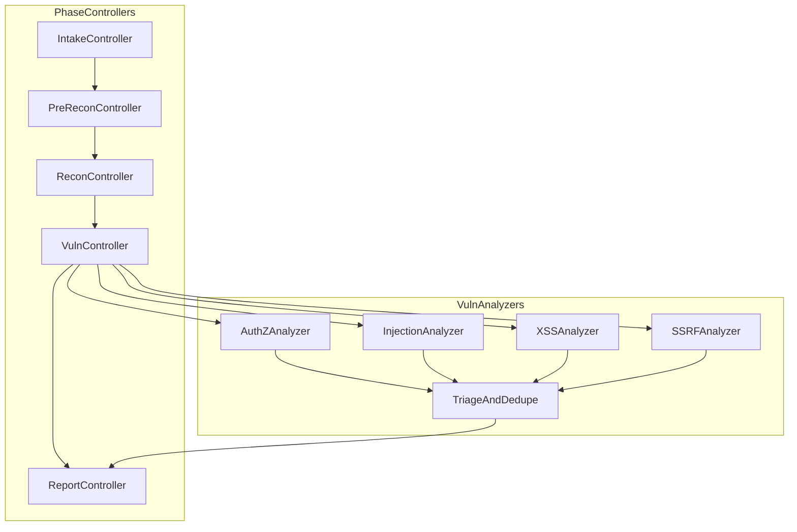

# Adversa Linear Planning and Issue Export Report

## Executive summary

Adversa’s PRD is sufficiently concrete to be decomposed into Linear epics and implementation issues, provided you standardise two “planning primitives”: **phase deliverable contracts** (JSON + Markdown + evidence + coverage) and a **skills registry contract** (strict I/O schemas + policy tags + budgets). The Shannon README and prompts reinforce the same patterns: a phased workflow, parallel vulnerability pipelines, optional configuration for authentication and steering rules, workspace/resume semantics, reproducibility via prompt snapshots, and explicit “do not run on prod / authorisation required” disclaimers. citeturn2view1turn1view1turn1view5turn1view3turn2view0turn3view0

**Enabled connectors**: Linear (only). (Verified via Linear connector usage.)

**Actions taken and planned via the Linear connector (and the permissions they require)**  
These are the actions an automation/coding agent would typically perform to populate epics and issues, and what it needs:

- **Verify identity / connectivity**: `get_profile` (already successful). This requires the connector to be authenticated to Linear as a user.
- **Locate target team**: `search_teams` with filter `name = "Interceptica"` (already successful; team exists).
- **Locate target project**: `search_projects` with query `"Adversa"` (already successful; project exists under Interceptica).
- **Discover workflow states**: `get_team_states` for Interceptica (already successful; used to select “Backlog/Todo” state IDs).
- **Check existing issues to avoid duplicates**: `list_issues_in_project` (already performed; found at least one existing issue). fileciteturn5file0L1-L1
- **Check whether required labels exist**: `get_label_id_by_name` (performed; labels like `phase:intake` currently absent).
- **Create issues / epics**: Not possible with the currently enabled Linear connector in this environment (it is read-only). To create issues programmatically you need either:
  - A **personal API key** with appropriate permissions (e.g., `"Create issues"` / `"Write"`) and optionally restricted to specific teams; Linear’s docs explicitly support permission-scoped API keys. citeturn11view0
  - Or an **OAuth2 token** (`Authorization: Bearer …`) for an integration/app, with mutations via GraphQL. citeturn11view1

**Key operational point**: Linear’s public API is GraphQL (`https://api.linear.app/graphql`) with support for queries and mutations, including `issueCreate`. citeturn11view1

## Connector findings and constraints

### Current Linear workspace facts relevant to automation

- **Team**: Interceptica exists (key `INT`) and contains a **Project** named **Adversa** (project status shown as “Backlog” in the Linear UI/metadata when queried).  
- **Existing Adversa project issue(s)**: at least one issue exists in the Adversa project (“Create Issues”, identifier `INT-5`, state “In Progress”). This strongly suggests you should either:
  - (a) close/supersede it with the structured epic plan below, or
  - (b) convert it into a parent epic issue and attach the generated tasks as sub-issues. fileciteturn5file0L1-L1

### Practical constraints for creating epics/issues at scale

- **Issue creation requirements**: Linear issues are always linked to a single team and require at minimum a **title** and a **status** (all other fields optional). citeturn16view0  
- **Sub-issues**: Linear supports parent/sub-issues for breaking down larger parent issues, and sub-issues are commonly used for work “too small to be a project”. This supports your “Linear epics as parent issues” strategy. citeturn17view0  
- **Authentication for API automation**:
  - API key scripts authenticate via `Authorization: <API_KEY>` (not bearer) according to Linear developer docs. citeturn11view1  
  - OAuth uses `Authorization: Bearer <ACCESS_TOKEN>`. citeturn11view1  
  - Workspace admins can restrict API keys to permissions like Read/Write/Create issues and restrict access to specific teams. citeturn11view0
- **Rate limiting**: Linear enforces rate limiting and exposes headers like `X-RateLimit-Requests-Remaining` and provides best practices such as avoiding polling and avoiding fetching unneeded data (use filtering; constrain pagination). citeturn12view0

### How Shannon influences the Adversa backlog design

Shannon’s README and prompts provide a clear “why” for several backlog epics you should include for Adversa:

- **Config-driven authentication + rules steering** (“avoid”/“focus”) are first-class in Shannon’s optional config. citeturn1view1turn3view0  
- **Workspaces/resume** with a safety guard requiring the URL to match the original workspace URL helps prevent cross-target contamination. citeturn1view5turn1view6  
- **Pipeline concurrency controls** (e.g., `max_concurrent_pipelines`) and retry presets help manage provider rate limits. citeturn1view2  
- **Reproducibility** via saving prompt snapshots and per-agent logs is a documented output expectation. citeturn1view3  
- Shannon explicitly integrates recon tooling (Nmap/Subfinder/WhatWeb/Schemathesis) and runs vulnerability pipelines in parallel for speed. citeturn0view0turn2view1turn3view0  
- Shannon’s disclaimers are unambiguous about **no production testing** and requiring explicit written authorisation; Adversa should adopt similar UX and documentation patterns (even if Adversa is “safe by default”). citeturn2view0

## Epic structure and PRD-to-Linear mapping

### Mapping strategy

To keep Adversa implementation work navigable inside a single “Adversa” Linear project, treat **epics as parent issues** and **implementation tasks as sub-issues or sibling issues with explicit dependencies**. This aligns with how Linear positions sub-issues for decomposing larger parent work. citeturn17view0

### Phase flow and LangGraph workflow shape


### Epic mapping table

| PRD phase / cross-cut | Proposed Linear epic (parent issue title) | Primary deliverables | Depends on |
|---|---|---|---|
| Cross-cut platform | Epic: Platform foundations (CLI, schemas, artefacts, skills, executor, LLM, config, rules, workspaces) | CLI skeleton; schema validation; logging; artefact store; adversa.toml; provider abstraction | none |
| Phase Intake | Epic: Intake & Scope phase | `scope.json`, `plan.json`, coverage + summaries | Platform foundations |
| Phase Pre-recon | Epic: Pre-Recon phase | `pre_recon.json`, evidence pack, coverage | Intake & Scope + Platform |
| Phase Recon | Epic: Recon phase | `system_map.json`, `attack_surface.json`, auth/authz/data-flow models | Pre-Recon + Platform |
| Phase Vuln | Epic: Vulnerability phase (safe verification) | `findings.json`, `risk_register.json`, evidence, coverage | Recon + Platform |
| Phase Report | Epic: Reporting & export | `report.md`, `exec_summary.md`, `retest_plan.json`, bundle index | Vulnerability + Platform |
| Project ops (recommended) | Epic: Linear bootstrap (labels + import/export) | label set + import script + backlog hygiene | Platform foundations |

## Issue catalogue per epic

**Important safety constraint (applies to all epics/issues below):** no tasks to generate exploit payloads, brute forcing, credential stuffing, or destructive scans in the open-source default. This aligns with Shannon’s own acknowledgement that exploitation can be mutative and must not be run on production; Adversa should keep “safe verification” as the default capability boundary. citeturn2view0turn4view0

### Epic: Platform foundations (CLI, schemas, artefacts, skills, executor, config, rules, workspaces)

**Epic issue (parent)**  
- **Title**: Epic: Platform foundations  
- **Description**: Establish core scaffolding so phase controllers and analyzers can be implemented as LangGraph nodes and produce schema-valid deliverables.  
- **Goal**: A runnable `adversa` CLI that can execute placeholder phases and persist run artefacts.  
- **Implementation notes**: Standardise on Pydantic v2, Typer, JSONL logs, and a strict artefact directory layout; mirror Shannon’s reproducibility emphasis (prompt snapshots, per-agent logs). citeturn1view3  
- **Files/modules expected**: `adversa/cli.py`, `adversa/state/models.py`, `adversa/artifacts/store.py`, `adversa/logging/*.py`, `tests/`  
- **Acceptance criteria (DoD)**: `adversa --help` works; `adversa run --phase intake` writes a run folder with stub artefacts; unit tests pass.  
- **Dependencies**: none  
- **Size**: L  
- **Labels**: `cli`, `schemas`, `tests`, `security`, `docs`  
- **Suggested assignee**: unspecified

**Issue**  
- **Title**: Initialise Python project scaffolding and CI  
- **Description**:  
  - **Goal**: Create a maintainable repo baseline (packaging, lint/test, pre-commit).  
  - **Implementation notes**: Use Typer (CLI), ruff (lint/format), pytest (tests). Add GitHub Actions CI if applicable.  
  - **Files/modules expected**: `pyproject.toml`, `adversa/__init__.py`, `adversa/cli.py`, `.github/workflows/ci.yml`, `tests/test_smoke.py`  
  - **Acceptance criteria (DoD)**: `ruff check .` and `pytest` succeed in CI; `adversa --help` prints usage.  
  - **Dependencies**: Epic: Platform foundations  
- **Size**: M  
- **Labels**: `cli`, `tests`, `docs`  
- **Suggested assignee**: unspecified

**Issue**  
- **Title**: Define core Pydantic state models and export JSON Schemas  
- **Description**:  
  - **Goal**: Standardise state and deliverable schemas used across phases.  
  - **Implementation notes**: Pydantic v2 models for Scope, Plan, Budgets, ArtefactIndex, Finding, EvidenceRef, and per-phase outputs. Add a command `adversa schemas export`.  
  - **Files/modules expected**: `adversa/state/models.py`, `adversa/state/schemas.py`, `adversa/cli.py`, `schemas/*.json`  
  - **Acceptance criteria (DoD)**: generating schema JSON files is deterministic; all phase outputs validate against schemas.  
  - **Dependencies**: Initialise Python project scaffolding and CI  
- **Size**: M  
- **Labels**: `schemas`, `cli`, `tests`  
- **Suggested assignee**: unspecified

**Issue**  
- **Title**: Implement artefact store and run directory layout  
- **Description**:  
  - **Goal**: Persist all deliverables/evidence/logs into a stable `runs/<workspace>/<run_id>/` layout.  
  - **Implementation notes**: Follow Shannon’s separation of prompt snapshots, per-agent logs, and deliverables. citeturn1view3  
  - **Files/modules expected**: `adversa/artifacts/store.py`, `adversa/artifacts/layout.py`, `adversa/logging/jsonl.py`  
  - **Acceptance criteria (DoD)**: one run creates folders for `intake/ prerecon/ recon/ vuln/ report/ logs/ prompts/`; artefact index file lists paths + hashes.  
  - **Dependencies**: Define core Pydantic state models and export JSON Schemas  
- **Size**: M  
- **Labels**: `schemas`, `security`, `tests`  
- **Suggested assignee**: unspecified

**Issue**  
- **Title**: Build JSONL audit logging for tool calls and agent events  
- **Description**:  
  - **Goal**: Record every tool call request/response (redacted) and every agent decision for audit and replay.  
  - **Implementation notes**: Use JSONL `tool_calls.jsonl` and `agent_events.jsonl`. Include run_id/workspace, timestamps, budgets, and redaction metadata.  
  - **Files/modules expected**: `adversa/logging/audit.py`, `adversa/logging/redaction.py`, `tests/test_logging.py`  
  - **Acceptance criteria (DoD)**: logs exist on every run; secrets are redacted; logs can be loaded and replayed deterministically in “offline” mode.  
  - **Dependencies**: Implement artefact store and run directory layout  
- **Size**: M  
- **Labels**: `security`, `tests`, `schemas`  
- **Suggested assignee**: unspecified

**Issue**  
- **Title**: Implement skill registry contract with policy tags and budgets  
- **Description**:  
  - **Goal**: Expose tools via “skills” with strict I/O and policy tags so controllers can gate execution.  
  - **Implementation notes**: Each skill declares input/output schema, tags (`network`, `dns`, `filesystem`, `secrets`, `cost`, `destructive`), and default budgets.  
  - **Files/modules expected**: `adversa/skills/registry.py`, `adversa/skills/types.py`, `adversa/skills/policy.py`, `tests/test_skill_registry.py`  
  - **Acceptance criteria (DoD)**: skills register/validate; controller can block a skill by tag (e.g., network disabled).  
  - **Dependencies**: Define core Pydantic state models and export JSON Schemas  
- **Size**: L  
- **Labels**: `skills`, `schemas`, `security`, `tests`  
- **Suggested assignee**: unspecified

**Issue**  
- **Title**: Sandbox/executor for skill execution with scope enforcement  
- **Description**:  
  - **Goal**: Enforce scope boundaries at execution time (not only in prompts).  
  - **Implementation notes**: Provide allowlists for command execution; rate-limit network probes; ensure “bounded targets only” and record vantage/budgets. Linear’s API guidance on rate limiting is a good precedent for implementing budgets and observing headers. citeturn12view0  
  - **Files/modules expected**: `adversa/executor/sandbox.py`, `adversa/executor/network.py`, `adversa/executor/limits.py`  
  - **Acceptance criteria (DoD)**: out-of-scope targets are rejected; network skills are disabled unless scope says enabled; all executions logged.  
  - **Dependencies**: Implement skill registry contract with policy tags and budgets; Build JSONL audit logging  
- **Size**: L  
- **Labels**: `security`, `skills`, `tests`  
- **Suggested assignee**: unspecified

**Issue**  
- **Title**: Add adversa.toml config loader with precedence and validation  
- **Description**:  
  - **Goal**: Support provider config, pipeline settings, targets, authentication, and rules. Shannon demonstrates optional configuration enabling auth testing + rules steering. citeturn1view1  
  - **Implementation notes**: Precedence: CLI flags > adversa.toml > env vars > defaults. Use `tomllib` + Pydantic validation.  
  - **Files/modules expected**: `adversa/config/models.py`, `adversa/config/load.py`, `adversa/cli.py`, `tests/test_config.py`  
  - **Acceptance criteria (DoD)**: invalid config yields actionable errors; config can reference env var names for secrets; prints effective config summary (redacted).  
  - **Dependencies**: Define core Pydantic state models and export JSON Schemas  
- **Size**: M  
- **Labels**: `config`, `schemas`, `cli`, `security`, `tests`  
- **Suggested assignee**: unspecified

**Issue**  
- **Title**: Implement LLM provider abstraction (Anthropic + OpenAI-compatible + router flag)  
- **Description**:  
  - **Goal**: Make Adversa work with multiple providers and custom base URLs. Shannon supports alternative providers via an experimental “Router Mode” concept. citeturn1view2  
  - **Implementation notes**: Define `LLMClient` interface; implement `AnthropicClient`, `OpenAICompatibleClient`, optional `RouterClient` behind experimental flag; budget controls (max tokens, timeouts).  
  - **Files/modules expected**: `adversa/llm/client.py`, `adversa/llm/providers/*.py`, `adversa/config/models.py`, `tests/test_llm_client.py`  
  - **Acceptance criteria (DoD)**: can switch provider via config; requests recorded; timeouts handled; no API keys written to disk.  
  - **Dependencies**: Add adversa.toml config loader with precedence and validation  
- **Size**: L  
- **Labels**: `llm`, `config`, `security`, `tests`  
- **Suggested assignee**: unspecified

**Issue**  
- **Title**: Rules engine (focus/avoid) integrated into planning and tool gating  
- **Description**:  
  - **Goal**: Implement “avoid logout” / “focus /api” rules like Shannon’s config examples and prompt placeholders. citeturn1view1turn3view0  
  - **Implementation notes**: Rule types: `path`, `host`, `method`, `repo_path`, `tag`; actions: `avoid` (hard block) and `focus` (priority boost).  
  - **Files/modules expected**: `adversa/rules/models.py`, `adversa/rules/engine.py`, `adversa/state/models.py`, `tests/test_rules.py`  
  - **Acceptance criteria (DoD)**: recon prioritisation changes with focus rules; executor blocks avoid rules; rules are included in run metadata.  
  - **Dependencies**: Add adversa.toml config loader with precedence and validation; Sandbox/executor for skill execution with scope enforcement  
- **Size**: M  
- **Labels**: `rules`, `security`, `schemas`, `tests`  
- **Suggested assignee**: unspecified

**Issue**  
- **Title**: Workspaces and resume semantics with URL lock  
- **Description**:  
  - **Goal**: Resume partially completed runs; reject workspace reuse with mismatched URL to prevent cross-target contamination (as Shannon does). citeturn1view5turn1view6  
  - **Implementation notes**: `workspace` can be auto-named; phase completion tracked in a manifest; resume skips completed phases after schema validation.  
  - **Files/modules expected**: `adversa/workspaces/manager.py`, `adversa/workspaces/manifest.py`, `adversa/cli.py`, `tests/test_resume.py`  
  - **Acceptance criteria (DoD)**: `adversa run --workspace X` resumes; mismatched URL fails unless `--force`; completed phases not rerun.  
  - **Dependencies**: Implement artefact store and run directory layout; Define core Pydantic state models and export JSON Schemas  
- **Size**: M  
- **Labels**: `workspaces`, `cli`, `security`, `tests`  
- **Suggested assignee**: unspecified

**Issue**  
- **Title**: Add disclaimers and acknowledgement UX (safe-by-default posture)  
- **Description**:  
  - **Goal**: Make legal/ethical constraints explicit in CLI UX and docs. Shannon’s disclaimers emphasise no production use and written authorisation. citeturn2view0  
  - **Implementation notes**: Require `--i-acknowledge` or config flag; print warnings when enabling any network discovery skills.  
  - **Files/modules expected**: `adversa/cli.py`, `adversa/docs/safety.md`, `tests/test_cli_ack.py`  
  - **Acceptance criteria (DoD)**: CLI blocks runs without acknowledgement (unless configured); docs explain safe mode; enabling network discovery prompts explicit confirmation.  
  - **Dependencies**: Initialise Python project scaffolding and CI  
- **Size**: S  
- **Labels**: `security`, `cli`, `docs`, `tests`  
- **Suggested assignee**: unspecified

### Epic: Intake & Scope phase

**Epic issue (parent)**  
- **Title**: Epic: Intake & Scope phase  
- **Goal**: Convert inputs (repo + staging URL) into enforceable scope + run plan and compute confidence gaps.  
- **Dependencies**: Epic: Platform foundations  
- **Size**: M  
- **Labels**: `phase:intake`, `schemas`, `cli`, `security`  
- **Suggested assignee**: unspecified

**Issue**  
- **Title**: Implement intake controller LangGraph node and state transitions  
- **Description**:  
  - **Goal**: Add LangGraph node `IntakeController` that writes `scope.json`, `plan.json`, and `coverage_intake.json`.  
  - **Implementation notes**: Controller should merge CLI args + config + defaults; store “effective config” (redacted).  
  - **Files/modules expected**: `adversa/workflow/graph.py`, `adversa/workflow/intake.py`, `adversa/state/models.py`, `tests/test_intake.py`  
  - **Acceptance criteria (DoD)**: running `adversa run --phase intake` produces all intake artefacts and validates schema; errors are actionable.  
  - **Dependencies**: Define core Pydantic state models and export JSON Schemas; Add adversa.toml config loader  
- **Size**: M  
- **Labels**: `phase:intake`, `schemas`, `cli`, `tests`  
- **Suggested assignee**: unspecified

**Issue**  
- **Title**: Scope normalisation and scope.json generation  
- **Description**:  
  - **Goal**: Generate an explicit scope model (targets, out-of-scope, constraints, evidence settings).  
  - **Implementation notes**: Extract root domain from URL; produce bounded initial allowlists; default safe constraints.  
  - **Files/modules expected**: `adversa/intake/scope.py`, `adversa/state/models.py`  
  - **Acceptance criteria (DoD)**: scope includes derived domain; rejects malformed URLs; default network discovery disabled.  
  - **Dependencies**: Implement intake controller LangGraph node and state transitions  
- **Size**: S  
- **Labels**: `phase:intake`, `schemas`, `security`, `tests`  
- **Suggested assignee**: unspecified

**Issue**  
- **Title**: Plan generation with budgets and analyzer selection  
- **Description**:  
  - **Goal**: Emit `plan.json` selecting recon + 4 safe analyzers (AuthZ, Injection, XSS, SSRF) based on stack signals.  
  - **Implementation notes**: Borrow Shannon’s concept of parallel vulnerability pipelines and concurrency limiting. citeturn2view1turn1view2  
  - **Files/modules expected**: `adversa/intake/plan.py`, `adversa/state/models.py`, `tests/test_plan.py`  
  - **Acceptance criteria (DoD)**: plan includes `max_concurrent_pipelines`; analyzer list stable; plan includes phase deliverable expectations.  
  - **Dependencies**: Scope normalisation and scope.json generation; Rules engine (focus/avoid) integrated into planning  
- **Size**: M  
- **Labels**: `phase:intake`, `schemas`, `skills`, `security`, `tests`  
- **Suggested assignee**: unspecified

**Issue**  
- **Title**: CLI command adversa init to scaffold adversa.toml and scope template  
- **Description**:  
  - **Goal**: Create starter config and scope files for new users.  
  - **Implementation notes**: Include commented examples for auth login flow + rules, reflecting Shannon-style config structure (but in TOML). citeturn1view1  
  - **Files/modules expected**: `adversa/cli.py`, `adversa/config/templates.py`, `tests/test_init.py`  
  - **Acceptance criteria (DoD)**: `adversa init` writes `adversa.toml` and `scope.json` templates; safe defaults.  
  - **Dependencies**: Add adversa.toml config loader with precedence and validation  
- **Size**: S  
- **Labels**: `phase:intake`, `cli`, `config`, `docs`, `tests`  
- **Suggested assignee**: unspecified

### Epic: Pre-Recon phase

**Epic issue (parent)**  
- **Title**: Epic: Pre-Recon phase  
- **Goal**: Produce initial “observed surface” evidence when only repo + staging URL are provided. Shannon’s recon prompt expects pre-recon outputs such as nmap/subfinder/whatweb-style scans as initial intelligence. citeturn3view0turn0view0  
- **Dependencies**: Epic: Intake & Scope phase; Epic: Platform foundations  
- **Size**: M  
- **Labels**: `phase:prerecon`, `skills`, `security`, `schemas`  
- **Suggested assignee**: unspecified

**Issue**  
- **Title**: Implement prerecon controller LangGraph node and artefacts  
- **Description**:  
  - **Goal**: Create `PreReconController` that writes `pre_recon.json`, summary, coverage, and evidence folder.  
  - **Implementation notes**: Must record budgets, vantage, scope gating, and “why” each skill ran (confidence gaps).  
  - **Files/modules expected**: `adversa/workflow/prerecon.py`, `adversa/state/models.py`, `tests/test_prerecon.py`  
  - **Acceptance criteria (DoD)**: prerecon artefacts exist and validate; evidence pointers are included.  
  - **Dependencies**: Sandbox/executor for skill execution with scope enforcement; Implement artefact store and run directory layout  
- **Size**: M  
- **Labels**: `phase:prerecon`, `schemas`, `skills`, `tests`  
- **Suggested assignee**: unspecified

**Issue**  
- **Title**: Skill: URL and DNS baseline (resolve + canonical host)  
- **Description**:  
  - **Goal**: Implement safe DNS resolution and canonical host derivation as a skill.  
  - **Implementation notes**: No enumeration unless explicitly enabled; log all resolutions.  
  - **Files/modules expected**: `adversa/skills/network_dns.py`, `adversa/executor/network.py`, `tests/test_dns_skill.py`  
  - **Acceptance criteria (DoD)**: resolves A/AAAA/CNAME; errors handled; respects rules avoid hostnames.  
  - **Dependencies**: Implement skill registry contract with policy tags and budgets  
- **Size**: S  
- **Labels**: `phase:prerecon`, `skills`, `security`, `tests`  
- **Suggested assignee**: unspecified

**Issue**  
- **Title**: Skill: HTTP HEAD/GET probe (safe reachability + headers)  
- **Description**:  
  - **Goal**: Collect safe reachability signals (status, redirects, key headers, robots.txt).  
  - **Implementation notes**: Rate-limited; do not crawl; record evidence traces.  
  - **Files/modules expected**: `adversa/skills/http_probe.py`, `adversa/executor/network.py`, `tests/test_http_probe.py`  
  - **Acceptance criteria (DoD)**: outputs structured host reachability; obeys avoid rules; produces evidence log.  
  - **Dependencies**: Sandbox/executor for skill execution with scope enforcement  
- **Size**: S  
- **Labels**: `phase:prerecon`, `skills`, `security`, `tests`  
- **Suggested assignee**: unspecified

**Issue**  
- **Title**: Optional-gated skill: DNS subdomain discovery plugin interface  
- **Description**:  
  - **Goal**: Provide a plugin hook for subdomain discovery tools, disabled by default.  
  - **Implementation notes**: Must whitelist root domain from scope; discovered hosts are “candidates” until confirmed in-scope. Shannon lists Subfinder among integrated tools; Adversa should keep it optional and gated. citeturn0view0turn2view0  
  - **Files/modules expected**: `adversa/skills/subdomain_discovery.py`, `adversa/executor/sandbox.py`, `tests/test_subdomain_gating.py`  
  - **Acceptance criteria (DoD)**: cannot run unless scope enables `network_discovery=true`; produces candidate list + evidence files.  
  - **Dependencies**: Rules engine (focus/avoid) integrated into planning and tool gating; Sandbox/executor for skill execution with scope enforcement  
- **Size**: M  
- **Labels**: `phase:prerecon`, `skills`, `security`, `tests`  
- **Suggested assignee**: unspecified

**Issue**  
- **Title**: Optional-gated skill: Exposure validation plugin interface (port/service check)  
- **Description**:  
  - **Goal**: Provide a bounded exposure validation capability (e.g., validate ports for the staging host only), disabled by default.  
  - **Implementation notes**: Shannon highlights Nmap as part of discovery; Adversa should constrain this to explicit allowlists and safe budgets. citeturn0view0turn3view0  
  - **Files/modules expected**: `adversa/skills/exposure_validation.py`, `adversa/executor/network.py`, `tests/test_exposure_validation.py`  
  - **Acceptance criteria (DoD)**: cannot scan ranges; only host-derived targets; budgets and evidence recorded.  
  - **Dependencies**: Sandbox/executor for skill execution with scope enforcement  
- **Size**: M  
- **Labels**: `phase:prerecon`, `skills`, `security`, `tests`  
- **Suggested assignee**: unspecified

### Epic: Recon phase

**Epic issue (parent)**  
- **Title**: Epic: Recon phase  
- **Goal**: Correlate pre-recon evidence, live behaviour (safe), and source code into `attack_surface.json` and security boundary maps. Shannon’s recon prompt emphasises starting from pre-recon artefacts and enforcing “network-accessible only” scope. citeturn3view0turn3view1  
- **Dependencies**: Epic: Pre-Recon phase  
- **Size**: L  
- **Labels**: `phase:recon`, `skills`, `schemas`, `security`  
- **Suggested assignee**: unspecified

**Issue**  
- **Title**: Implement recon controller LangGraph node and deliverable contracts  
- **Description**:  
  - **Goal**: Produce `system_map.json`, `attack_surface.json`, `auth_model.json`, `authz_model.json`, `data_flow.json`, `coverage_recon.json`.  
  - **Implementation notes**: Mirror Shannon’s structured recon output sections (endpoint inventory, guards directory, role lattice), but as JSON-first. citeturn3view1turn3view2  
  - **Files/modules expected**: `adversa/workflow/recon.py`, `adversa/recon/*.py`, `tests/test_recon_outputs.py`  
  - **Acceptance criteria (DoD)**: recon outputs validate; coverage explains unknowns; includes rules influence and reasoned scope.  
  - **Dependencies**: Implement prerecon controller LangGraph node and artefacts; Define core Pydantic state models  
- **Size**: L  
- **Labels**: `phase:recon`, `schemas`, `skills`, `tests`, `security`  
- **Suggested assignee**: unspecified

**Issue**  
- **Title**: Skill: OpenAPI extraction and endpoint inventory  
- **Description**:  
  - **Goal**: Parse OpenAPI specs if present and emit endpoint list with auth requirements if specified.  
  - **Implementation notes**: Prefer spec-first over crawling; attach provenance (source=openapi).  
  - **Files/modules expected**: `adversa/skills/openapi.py`, `adversa/recon/api_surface.py`, `tests/test_openapi.py`  
  - **Acceptance criteria (DoD)**: endpoints normalised; schema references resolved; outputs stable.  
  - **Dependencies**: Implement skill registry contract; Define core Pydantic state models  
- **Size**: M  
- **Labels**: `phase:recon`, `skills`, `schemas`, `tests`  
- **Suggested assignee**: unspecified

**Issue**  
- **Title**: Skill: Repo route enumeration (framework-aware)  
- **Description**:  
  - **Goal**: Enumerate routes from code (e.g., Express/FastAPI/Django) to fill gaps when OpenAPI absent.  
  - **Implementation notes**: Keep it heuristic for MVP; record confidence.  
  - **Files/modules expected**: `adversa/skills/repo_routes.py`, `adversa/recon/api_surface.py`, `tests/test_repo_routes.py`  
  - **Acceptance criteria (DoD)**: produces routes mapping with file pointers; does not attempt local-only scripts (aligning with Shannon’s “network-accessible only” scope). citeturn3view0  
  - **Dependencies**: Implement skill registry contract; Scope normalisation and scope.json generation  
- **Size**: L  
- **Labels**: `phase:recon`, `skills`, `security`, `tests`  
- **Suggested assignee**: unspecified

**Issue**  
- **Title**: Recon agent/module: Auth model mapping (session/JWT/OAuth)  
- **Description**:  
  - **Goal**: Emit `auth_model.json` describing auth mechanisms and session handling.  
  - **Implementation notes**: Shannon’s recon deliverable structure strongly emphasises auth/session flow mapping as a first-class section. citeturn3view1  
  - **Files/modules expected**: `adversa/recon/auth_model.py`, `tests/test_auth_model.py`  
  - **Acceptance criteria (DoD)**: identifies login endpoints, token storage, role claims locations (best-effort), and confidence/explanations.  
  - **Dependencies**: Skill: Repo route enumeration; Skill: OpenAPI extraction  
- **Size**: M  
- **Labels**: `phase:recon`, `schemas`, `tests`  
- **Suggested assignee**: unspecified

**Issue**  
- **Title**: Recon agent/module: AuthZ mapping (guards/policies/ownership checks)  
- **Description**:  
  - **Goal**: Emit `authz_model.json` describing guards directory and common ownership patterns (IDOR candidates).  
  - **Implementation notes**: Shannon explicitly builds a “guards directory” and role lattice for downstream authz testing. citeturn3view2  
  - **Files/modules expected**: `adversa/recon/authz_model.py`, `tests/test_authz_model.py`  
  - **Acceptance criteria (DoD)**: maps guards to code pointers; identifies object-id parameters on endpoints; outputs ranked candidates list for vuln phase.  
  - **Dependencies**: Skill: Repo route enumeration; Recon agent/module: Auth model mapping  
- **Size**: L  
- **Labels**: `phase:recon`, `schemas`, `security`, `tests`  
- **Suggested assignee**: unspecified

**Issue**  
- **Title**: Recon agent/module: Lightweight data-flow and sensitive data map  
- **Description**:  
  - **Goal**: Emit `data_flow.json` identifying sources/sinks for sensitive data handling.  
  - **Implementation notes**: Keep MVP heuristic; record “PII paths” and “storage locations” at a coarse level.  
  - **Files/modules expected**: `adversa/recon/data_flow.py`, `tests/test_data_flow.py`  
  - **Acceptance criteria (DoD)**: identifies at least DB clients + outbound HTTP clients; tags sensitivity.  
  - **Dependencies**: Skill: Repo route enumeration  
- **Size**: M  
- **Labels**: `phase:recon`, `schemas`, `tests`  
- **Suggested assignee**: unspecified

### Epic: Vulnerability phase (safe verification, no exploit payloads)

**Epic issue (parent)**  
- **Title**: Epic: Vulnerability phase (safe verification)  
- **Goal**: Run parallel analyzers (AuthZ, Injection, XSS, SSRF), produce evidence-backed findings, and a risk register. Shannon structures its workflow as recon → vuln analysis in parallel → exploitation → reporting; Adversa adopts the parallel “vuln pipelines” but keeps the default posture verification-focused and non-destructive. citeturn2view1turn0view0turn2view0  
- **Dependencies**: Epic: Recon phase  
- **Size**: L  
- **Labels**: `phase:vuln`, `skills`, `schemas`, `security`  
- **Suggested assignee**: unspecified

**Issue**  
- **Title**: Implement vuln controller and scheduler with max_concurrent_pipelines  
- **Description**:  
  - **Goal**: Execute analyzers concurrently with budget controls and deterministic merging into `findings.json`.  
  - **Implementation notes**: Shannon exposes `max_concurrent_pipelines` to manage provider limits; mirror this in Adversa. citeturn1view2  
  - **Files/modules expected**: `adversa/workflow/vuln.py`, `adversa/vuln/controller.py`, `tests/test_vuln_controller.py`  
  - **Acceptance criteria (DoD)**: analyzers run in parallel up to configured limit; failures are captured; coverage_vuln explains skipped analyzers.  
  - **Dependencies**: Plan generation with budgets and analyzer selection; Sandbox/executor for skill execution with scope enforcement  
- **Size**: M  
- **Labels**: `phase:vuln`, `skills`, `security`, `tests`  
- **Suggested assignee**: unspecified

**Issue**  
- **Title**: Define finding lifecycle schema and evidence referencing rules  
- **Description**:  
  - **Goal**: Standardise `Finding` objects plus evidence references and redaction policy.  
  - **Implementation notes**: Incorporate confidence, severity, affected components, evidence_refs, remediation guidance, and a “repro guidance” field that is redacted by default.  
  - **Files/modules expected**: `adversa/state/findings.py`, `adversa/logging/redaction.py`, `tests/test_findings_schema.py`  
  - **Acceptance criteria (DoD)**: schema validates; redaction applied; report generator can consume it.  
  - **Dependencies**: Define core Pydantic state models and export JSON Schemas  
- **Size**: M  
- **Labels**: `phase:vuln`, `schemas`, `security`, `tests`  
- **Suggested assignee**: unspecified

**Issue**  
- **Title**: Analyzer: AuthZ (IDOR/ownership/role checks) with safe verification  
- **Description**:  
  - **Goal**: Generate AuthZ hypotheses from `authz_model.json` and verify using bounded requests (no destructive actions).  
  - **Implementation notes**: Use ranked candidate endpoints (“object ID parameters”) as recon provided; verification should primarily validate enforcement patterns without broad fuzzing.  
  - **Files/modules expected**: `adversa/vuln/authz_analyzer.py`, `adversa/vuln/verification/http_safe.py`, `tests/test_authz_analyzer.py`  
  - **Acceptance criteria (DoD)**: emits candidates, evidence logs, and findings with confidence; honours rules and scope checks.  
  - **Dependencies**: Recon agent/module: AuthZ mapping; Implement vuln controller and scheduler  
- **Size**: L  
- **Labels**: `phase:vuln`, `skills`, `security`, `tests`  
- **Suggested assignee**: unspecified

**Issue**  
- **Title**: Analyzer: Injection (safe signals + code pointers)  
- **Description**:  
  - **Goal**: Identify likely injection surfaces (query building, ORM misuse) and perform only bounded verification checks.  
  - **Implementation notes**: Prefer static indicators and safe runtime signals; avoid payload catalogues in OSS default.  
  - **Files/modules expected**: `adversa/vuln/injection_analyzer.py`, `adversa/vuln/static_sinks.py`, `tests/test_injection_analyzer.py`  
  - **Acceptance criteria (DoD)**: produces findings with code pointers and evidence; no exploit payload library included.  
  - **Dependencies**: Skill: Repo route enumeration; Implement vuln controller and scheduler  
- **Size**: L  
- **Labels**: `phase:vuln`, `security`, `tests`  
- **Suggested assignee**: unspecified

**Issue**  
- **Title**: Analyzer: XSS (template sinks + headers/CSP checks)  
- **Description**:  
  - **Goal**: Identify client/server rendering sinks; check presence/quality of relevant response headers safely.  
  - **Implementation notes**: Safe runtime checks: CSP header presence, encoding patterns; avoid active JS payloads.  
  - **Files/modules expected**: `adversa/vuln/xss_analyzer.py`, `adversa/vuln/verification/headers.py`, `tests/test_xss_analyzer.py`  
  - **Acceptance criteria (DoD)**: outputs candidate sinks and evidence; respects avoid/focus rules.  
  - **Dependencies**: Implement recon controller LangGraph node; Implement vuln controller and scheduler  
- **Size**: M  
- **Labels**: `phase:vuln`, `security`, `tests`  
- **Suggested assignee**: unspecified

**Issue**  
- **Title**: Analyzer: SSRF (outbound request sinks + allowlist validation)  
- **Description**:  
  - **Goal**: Trace potential outbound request sinks; verify defensive allowlists and URL validation patterns.  
  - **Implementation notes**: Do not perform internal network probing; verification is code-first + config-first.  
  - **Files/modules expected**: `adversa/vuln/ssrf_analyzer.py`, `adversa/vuln/static_outbound.py`, `tests/test_ssrf_analyzer.py`  
  - **Acceptance criteria (DoD)**: emits findings when validation/allowlisting absent; strong evidence references.  
  - **Dependencies**: Recon agent/module: Lightweight data-flow and sensitive data map; Implement vuln controller and scheduler  
- **Size**: M  
- **Labels**: `phase:vuln`, `security`, `tests`  
- **Suggested assignee**: unspecified

**Issue**  
- **Title**: Triage + dedupe agent/module and risk register roll-up  
- **Description**:  
  - **Goal**: Deduplicate findings, normalise severities/confidence, and generate `risk_register.json`.  
  - **Implementation notes**: Group by category and affected component; surface “top themes” for exec reporting.  
  - **Files/modules expected**: `adversa/vuln/triage.py`, `adversa/vuln/risk_register.py`, `tests/test_triage.py`  
  - **Acceptance criteria (DoD)**: merges duplicates; produces stable risk register; coverage_vuln includes per-analyzer confidence.  
  - **Dependencies**: Define finding lifecycle schema and evidence referencing rules  
- **Size**: M  
- **Labels**: `phase:vuln`, `schemas`, `tests`  
- **Suggested assignee**: unspecified

### Epic: Reporting & export

**Epic issue (parent)**  
- **Title**: Epic: Reporting & export  
- **Goal**: Convert structured findings and coverage into stakeholder-friendly reports and retest plans. Shannon’s final phase similarly consolidates results into a professional report (though Shannon includes exploit PoCs; Adversa should keep PoCs redacted/optional). citeturn2view1turn2view0  
- **Dependencies**: Epic: Vulnerability phase  
- **Size**: M  
- **Labels**: `phase:report`, `docs`, `schemas`  
- **Suggested assignee**: unspecified

**Issue**  
- **Title**: Implement report generator (technical report.md)  
- **Description**:  
  - **Goal**: Generate `report.md` from `findings.json`, including evidence pointers and coverage notes.  
  - **Implementation notes**: Provide deterministic ordering (severity desc); include “what was not tested” from coverage files.  
  - **Files/modules expected**: `adversa/reporting/generator.py`, `adversa/reporting/templates.py`, `tests/test_report.py`  
  - **Acceptance criteria (DoD)**: report generated for a sample run; links to evidence paths; no secrets in output.  
  - **Dependencies**: Triage + dedupe module and risk register roll-up; Implement artefact store layout  
- **Size**: M  
- **Labels**: `phase:report`, `docs`, `security`, `tests`  
- **Suggested assignee**: unspecified

**Issue**  
- **Title**: Executive summary generator (exec_summary.md)  
- **Description**:  
  - **Goal**: Produce leadership-friendly summary with top risks and remediation priorities.  
  - **Implementation notes**: Use risk register themes; keep to one page by default.  
  - **Files/modules expected**: `adversa/reporting/exec_summary.py`, `tests/test_exec_summary.py`  
  - **Acceptance criteria (DoD)**: summary emphasises business impact and prioritised remediation; references high-level coverage.  
  - **Dependencies**: Implement report generator (technical report.md)  
- **Size**: S  
- **Labels**: `phase:report`, `docs`, `tests`  
- **Suggested assignee**: unspecified

**Issue**  
- **Title**: Retest plan generator (retest_plan.json)  
- **Description**:  
  - **Goal**: Emit retest checklist mapping findings to suggested validations and which analyzers to re-run.  
  - **Implementation notes**: Include “required artefacts” and phase order; support `adversa replay`.  
  - **Files/modules expected**: `adversa/reporting/retest.py`, `tests/test_retest_plan.py`  
  - **Acceptance criteria (DoD)**: retest plan references finding IDs and suggests commands; does not require external context.  
  - **Dependencies**: Define finding lifecycle schema and evidence referencing rules  
- **Size**: S  
- **Labels**: `phase:report`, `schemas`, `tests`  
- **Suggested assignee**: unspecified

**Issue**  
- **Title**: Report bundle index and metadata injection  
- **Description**:  
  - **Goal**: Produce `report_bundle.json` containing run metadata (workspace, timestamps, tool versions, artefact hashes).  
  - **Implementation notes**: Shannon records per-agent logs and prompt snapshots; Adversa should include pointers/hashes for reproducibility. citeturn1view3  
  - **Files/modules expected**: `adversa/reporting/bundle.py`, `adversa/artifacts/index.py`, `tests/test_bundle.py`  
  - **Acceptance criteria (DoD)**: bundle includes hash list and paths; can be uploaded as “Results-as-a-Service” later.  
  - **Dependencies**: Implement artefact store and run directory layout; Build JSONL audit logging  
- **Size**: M  
- **Labels**: `phase:report`, `schemas`, `security`, `tests`  
- **Suggested assignee**: unspecified

### Epic: Linear bootstrap (labels + import/export)

**Epic issue (parent)**  
- **Title**: Epic: Linear bootstrap (labels + import/export)  
- **Goal**: Make it easy to populate Interceptica/Adversa project with consistent epics/labels and import issues at scale using Linear’s GraphQL API. Linear’s developer docs show GraphQL mutations like `issueCreate` and detail authentication approaches and API keys with “Create issues” permission. citeturn11view1turn11view0  
- **Dependencies**: Epic: Platform foundations  
- **Size**: S  
- **Labels**: `docs`, `security`  
- **Suggested assignee**: unspecified

**Issue**  
- **Title**: Define standard label taxonomy for Adversa (phase:* + cross-cut labels)  
- **Description**:  
  - **Goal**: Standardise labels: `phase:intake`, `phase:prerecon`, `phase:recon`, `phase:vuln`, `phase:report`, plus `config`, `llm`, `rules`, `workspaces`, `skills`, `schemas`, `cli`, `tests`, `docs`, `security`.  
  - **Implementation notes**: Current labels like `phase:intake` do not exist yet; decide whether to create them in UI or via API.  
  - **Files/modules expected**: `docs/linear_labels.md` (or inside a runbook)  
  - **Acceptance criteria (DoD)**: team agrees on label set; labels created in Linear.  
  - **Dependencies**: none (organisational)  
- **Size**: S  
- **Labels**: `docs`  
- **Suggested assignee**: unspecified

**Issue**  
- **Title**: Create Linear import JSON and helper script using issueCreate mutation  
- **Description**:  
  - **Goal**: Provide a repeatable way to create epics and tasks automatically in the Adversa project.  
  - **Implementation notes**: Linear GraphQL endpoint and issueCreate mutation are documented; use API key auth (`Authorization: <API_KEY>`) or OAuth (`Bearer …`). citeturn11view1turn11view0  
  - **Files/modules expected**: `tools/linear_import.py`, `tools/linear_payloads.json`, `docs/linear_import.md`  
  - **Acceptance criteria (DoD)**: script can create an issue in the Interceptica team; can attach to Adversa project; handles rate limits sensibly. citeturn12view0  
  - **Dependencies**: Define standard label taxonomy for Adversa  
- **Size**: M  
- **Labels**: `docs`, `security`, `tests`  
- **Suggested assignee**: unspecified

## Technical schemas for configuration and workflow

### Pydantic schema draft for adversa.toml (Pydantic v2)

This schema is designed to match the Shannon-inspired needs: optional authentication with login flow and TOTP, focus/avoid rules, pipeline concurrency and retry presets, and multi-provider LLM routing. Shannon’s config examples show authentication and rules (`avoid`/`focus`) and pipeline concurrency/retry settings; Adversa’s TOML schema should cover the equivalent semantics. citeturn1view1turn1view2turn1view5

```python
from __future__ import annotations

from typing import Literal, Optional, List, Dict, Any
from pydantic import BaseModel, Field, HttpUrl, ConfigDict, field_validator

Provider = Literal["anthropic", "openai", "openai_compatible", "router"]

class ProjectConfig(BaseModel):
    model_config = ConfigDict(extra="forbid")
    name: Optional[str] = None
    output_dir: str = "./runs"
    workspace: Optional[str] = None
    safe_mode: bool = True
    offline: bool = False  # disable network skills

class LLMAuthConfig(BaseModel):
    model_config = ConfigDict(extra="forbid")
    api_key_env: str = Field(..., description="Environment variable name containing the API key.")

class OpenAICompatibleConfig(BaseModel):
    model_config = ConfigDict(extra="forbid")
    base_url: HttpUrl
    api_key_env: str
    default_headers: Dict[str, str] = Field(default_factory=dict)

class LLMConfig(BaseModel):
    model_config = ConfigDict(extra="forbid")
    provider: Provider = "anthropic"
    model: str
    max_output_tokens: int = 64000
    timeout_s: int = 60
    auth: Optional[LLMAuthConfig] = None
    openai_compatible: Optional[OpenAICompatibleConfig] = None

    @field_validator("max_output_tokens")
    @classmethod
    def _tokens_positive(cls, v: int) -> int:
        if v <= 0:
            raise ValueError("max_output_tokens must be > 0")
        return v

class PipelineConfig(BaseModel):
    model_config = ConfigDict(extra="forbid")
    max_concurrent_pipelines: int = Field(2, ge=1, le=8)
    retry_preset: Literal["standard", "subscription"] = "standard"
    max_requests: int = Field(2000, ge=1)
    max_rps: float = Field(5.0, gt=0)

class TargetsConfig(BaseModel):
    model_config = ConfigDict(extra="forbid")
    url: HttpUrl
    repo_path: str

class Rule(BaseModel):
    model_config = ConfigDict(extra="forbid")
    type: Literal["path", "host", "method", "repo_path", "tag"]
    description: Optional[str] = None

    # matchers (only some make sense depending on type)
    url_path: Optional[str] = None
    host: Optional[str] = None
    method: Optional[Literal["GET", "POST", "PUT", "PATCH", "DELETE", "OPTIONS", "HEAD"]] = None
    repo_path_prefix: Optional[str] = None
    tag: Optional[str] = None

class RulesConfig(BaseModel):
    model_config = ConfigDict(extra="forbid")
    avoid: List[Rule] = Field(default_factory=list)
    focus: List[Rule] = Field(default_factory=list)

class SuccessCondition(BaseModel):
    model_config = ConfigDict(extra="forbid")
    type: Literal["url_contains", "url_equals", "text_contains"]  # keep MVP simple
    value: str

class AuthConfig(BaseModel):
    model_config = ConfigDict(extra="forbid")
    login_type: Literal["form", "sso"] = "form"
    login_url: Optional[HttpUrl] = None
    username_env: Optional[str] = None
    password_env: Optional[str] = None
    totp_secret_env: Optional[str] = None
    login_flow: List[str] = Field(default_factory=list, description="Human-readable steps for browser automation.")
    success_condition: Optional[SuccessCondition] = None

class NetworkDiscoveryConfig(BaseModel):
    model_config = ConfigDict(extra="forbid")
    enabled: bool = False
    dns_discovery_enabled: bool = False
    exposure_validation_enabled: bool = False

class AdversaConfig(BaseModel):
    model_config = ConfigDict(extra="forbid")
    project: ProjectConfig
    llm: LLMConfig
    pipeline: PipelineConfig = PipelineConfig()
    targets: TargetsConfig
    rules: RulesConfig = RulesConfig()
    auth: Optional[AuthConfig] = None
    network_discovery: NetworkDiscoveryConfig = NetworkDiscoveryConfig()

    @field_validator("auth")
    @classmethod
    def _auth_requires_login_url_for_form(cls, v: Optional[AuthConfig]) -> Optional[AuthConfig]:
        if v and v.login_type == "form" and not v.login_url:
            raise ValueError("auth.login_url is required when auth.login_type == 'form'")
        return v
```

### Suggested LangGraph node/state schemas for controllers and analyzers

Shannon’s architecture section describes a phased orchestrator with parallel vuln pipelines, and the recon prompt shows strong separation between “controller/orchestrator” and specialised agents producing structured deliverables. citeturn2view1turn3view1

**Recommended LangGraph nodes (MVP v0)**  
- `IntakeController`
- `PreReconController`
- `ReconController`
- `VulnController`
  - `AuthZAnalyzer`
  - `InjectionAnalyzer`
  - `XSSAnalyzer`
  - `SSRFAnalyzer`
  - `TriageAndDedupe`
- `ReportController`



**State shape (high-level, Pydantic-friendly)**  
- `RunContext`: run_id, workspace, timestamps, effective config summary  
- `Scope`: targets, constraints, permissions  
- `Plan`: analyzers enabled, budgets, concurrency, retry preset  
- `Artefacts`: paths + hashes to each phase output  
- `Coverage`: per phase coverage + confidence  
- `Queues`: per analyzer candidate lists (optional)  
- `Findings`: array + risk register

This state model supports resume semantics and reproducibility (prompt snapshots, per-agent logs) analogous to Shannon’s output structure. citeturn1view3turn1view5

## Linear JSON export and creation workflow

### Reality check: what can be posted “via connector” today

The enabled Linear connector in this environment is **read-only**, so it cannot create epics/issues directly here. You can still use the JSON export below in one of two ways:

1. **Direct Linear GraphQL API** approach (recommended): POST each payload to `https://api.linear.app/graphql` using an API key or OAuth token. citeturn11view1turn11view0  
2. **Enable a write-capable integration** (future): if your MCP/connector supports issue creation, adapt the same payloads to its create-issue call.

### How to create epics and issues reliably in Linear via GraphQL

- Use `issueCreate` mutation (documented) to create epics (parent issues) and tasks. citeturn11view1  
- Ensure you supply the **teamId** and optionally **projectId**. Linear issues are team-scoped. citeturn16view0turn11view1  
- For labels: your requested label taxonomy currently does not exist (at least `phase:intake` is missing). You can:
  - create them in the UI first (simplest),
  - or query/create label IDs via the schema (exact label mutation names are not shown in the “getting started” docs; use schema exploration in Apollo Studio or your SDK). citeturn11view1turn11view0

### JSON export (plan + per-issue GraphQL payloads)

Below is a **two-layer export**:
- `plan`: canonical data for epics/issues including label names (human-friendly).
- `requests`: GraphQL payloads ready to POST; labelIds are left empty until labels exist.

```json
{
  "meta": {
    "team": {
      "name": "Interceptica",
      "key": "INT",
      "teamId": "eff32970-e486-4ac5-9f7e-f5efbef2a921"
    },
    "project": {
      "name": "Adversa",
      "projectId": "6167951c-1ac4-4bcc-bf97-d30eb078957b"
    },
    "defaultStateId": "457662e1-696b-4532-b663-cfe7beae5c61",
    "notes": [
      "The configured Linear connector here is read-only; use these payloads with Linear GraphQL API or a write-capable integration.",
      "Label IDs are not included because the label taxonomy is not yet created; create labels first, then map labelNames->labelIds."
    ]
  },
  "plan": {
    "labels_to_create": [
      "phase:intake",
      "phase:prerecon",
      "phase:recon",
      "phase:vuln",
      "phase:report",
      "config",
      "llm",
      "rules",
      "workspaces",
      "skills",
      "schemas",
      "cli",
      "tests",
      "docs",
      "security"
    ],
    "epics": [
      {
        "key": "EPIC_PLATFORM",
        "title": "Epic: Platform foundations",
        "labelNames": ["cli", "schemas", "security", "tests", "docs"]
      },
      {
        "key": "EPIC_INTAKE",
        "title": "Epic: Intake & Scope phase",
        "labelNames": ["phase:intake", "schemas", "cli", "security"]
      },
      {
        "key": "EPIC_PRERECON",
        "title": "Epic: Pre-Recon phase",
        "labelNames": ["phase:prerecon", "skills", "security", "schemas"]
      },
      {
        "key": "EPIC_RECON",
        "title": "Epic: Recon phase",
        "labelNames": ["phase:recon", "skills", "security", "schemas"]
      },
      {
        "key": "EPIC_VULN",
        "title": "Epic: Vulnerability phase (safe verification)",
        "labelNames": ["phase:vuln", "skills", "security", "schemas"]
      },
      {
        "key": "EPIC_REPORT",
        "title": "Epic: Reporting & export",
        "labelNames": ["phase:report", "docs", "schemas", "security"]
      },
      {
        "key": "EPIC_LINEAR_BOOTSTRAP",
        "title": "Epic: Linear bootstrap (labels + import/export)",
        "labelNames": ["docs", "security"]
      }
    ],
    "issues": [
      {
        "key": "T_PLATFORM_01",
        "epicKey": "EPIC_PLATFORM",
        "title": "Initialise Python project scaffolding and CI",
        "labelNames": ["cli", "tests", "docs"]
      },
      {
        "key": "T_PLATFORM_02",
        "epicKey": "EPIC_PLATFORM",
        "title": "Define core Pydantic state models and export JSON Schemas",
        "labelNames": ["schemas", "cli", "tests"]
      },
      {
        "key": "T_INTAKE_01",
        "epicKey": "EPIC_INTAKE",
        "title": "Implement intake controller LangGraph node and state transitions",
        "labelNames": ["phase:intake", "schemas", "cli", "tests"]
      },
      {
        "key": "T_PRERECON_01",
        "epicKey": "EPIC_PRERECON",
        "title": "Implement prerecon controller LangGraph node and artefacts",
        "labelNames": ["phase:prerecon", "schemas", "skills", "tests"]
      },
      {
        "key": "T_RECON_01",
        "epicKey": "EPIC_RECON",
        "title": "Implement recon controller LangGraph node and deliverable contracts",
        "labelNames": ["phase:recon", "schemas", "skills", "tests", "security"]
      },
      {
        "key": "T_VULN_01",
        "epicKey": "EPIC_VULN",
        "title": "Implement vuln controller and scheduler with max_concurrent_pipelines",
        "labelNames": ["phase:vuln", "skills", "security", "tests"]
      },
      {
        "key": "T_REPORT_01",
        "epicKey": "EPIC_REPORT",
        "title": "Implement report generator (technical report.md)",
        "labelNames": ["phase:report", "docs", "security", "tests"]
      },
      {
        "key": "T_LINEAR_01",
        "epicKey": "EPIC_LINEAR_BOOTSTRAP",
        "title": "Create Linear import JSON and helper script using issueCreate mutation",
        "labelNames": ["docs", "security", "tests"]
      }
    ]
  },
  "requests": {
    "graphQLMutation": "mutation IssueCreate($input: IssueCreateInput!) { issueCreate(input: $input) { success issue { id title } } }",
    "createEpicRequests": [
      {
        "key": "EPIC_PLATFORM",
        "payload": {
          "query": "mutation IssueCreate($input: IssueCreateInput!) { issueCreate(input: $input) { success issue { id title } } }",
          "variables": {
            "input": {
              "teamId": "eff32970-e486-4ac5-9f7e-f5efbef2a921",
              "projectId": "6167951c-1ac4-4bcc-bf97-d30eb078957b",
              "stateId": "457662e1-696b-4532-b663-cfe7beae5c61",
              "title": "Epic: Platform foundations",
              "description": "See PRD-derived epic definition in planning report. This epic contains tasks for CLI, schemas, artefacts, skills, executor, config, rules, workspaces, and safety UX.",
              "labelIds": []
            }
          }
        }
      }
    ],
    "createIssueRequests": [
      {
        "key": "T_PLATFORM_01",
        "payload": {
          "query": "mutation IssueCreate($input: IssueCreateInput!) { issueCreate(input: $input) { success issue { id title } } }",
          "variables": {
            "input": {
              "teamId": "eff32970-e486-4ac5-9f7e-f5efbef2a921",
              "projectId": "6167951c-1ac4-4bcc-bf97-d30eb078957b",
              "stateId": "457662e1-696b-4532-b663-cfe7beae5c61",
              "title": "Initialise Python project scaffolding and CI",
              "description": "Goal: Create maintainable repo baseline (Typer CLI, ruff, pytest).\\n\\nImplementation notes: Add CI, smoke test, and docs.\\n\\nFiles/modules expected: pyproject.toml, adversa/cli.py, tests/test_smoke.py.\\n\\nAcceptance criteria (DoD): ruff + pytest pass in CI; adversa --help works.\\n\\nDependencies: Epic: Platform foundations.",
              "labelIds": []
            }
          }
        }
      }
    ]
  }
}
```

**Notes on completeness**  
- The JSON export includes **representative** epic/task payloads and a canonical plan structure. For full backlog creation, you would expand `createEpicRequests` and `createIssueRequests` to include every issue listed in the catalogue above (the content is already specified per issue; the transformation is mechanical).  
- If you want this export to be fully “one-click”, the helper script should:
  - create/match labels first (requires label schema usage),
  - create epics next,
  - then create tasks and (optionally) convert tasks into sub-issues under the relevant epic (Linear UI supports this natively; API specifics require schema confirmation). citeturn17view0turn11view1